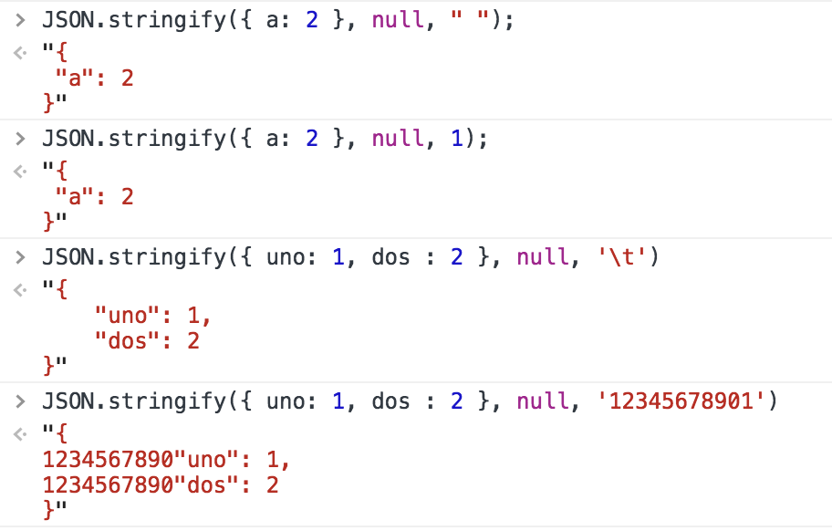

# JSON.stringify的使用注意点

1.undefined、任意的函数以及 symbol 值，在序列化过程中会被忽略（出现在非数组对象的属性值中时）或者被转换成 null（出现在数组中时）

```js
JSON.stringify({x: undefined, y: Object, z: Symbol("")});
// "{}"

JSON.stringify([undefined, Object, Symbol("")]);
// "[null,null,null]"
```

2.对包含循环引用的对象（对象之间相互引用，形成无限循环\) 序列话时，会抛出错误 Converting circular structure to JSON

```js
const obj1 = {}
const obj2 = {}

obj1.x = obj2
obj2.x = obj1

JSON.stringify(obj1)
// Uncaught TypeError: Converting circular structure to JSON
// at JSON.stringify (<anonymous>)
// at <anonymous>:1:6
```

3.不可枚举的属性会被忽略

```js
const obj = {x: 1}

Object.defineProperty(obj, 'y', {value: 2})

JSON.stringify(obj)
// "{"x":1}"
```

4.JSON.stringify\(\) 可接受第二个参数

```
JSON.stringify(value[, replacer])
```

参数 replacer ：

| replacer | 描述 |
| :--- | :--- |
| 函数 | value的每个属性都会经过该函数的转换和处理，函数有两个参数: 键\(key\)值\(value\) |
| 数组 | 只有包含在这个数组中的属性才会被序列化到最终的JSON字符串中 |
| null或未提供 | value的所有属性都会被序列化 |

```js
// replacer 为函数

const replacer = function(key, value){
if(typeof(value) === 'function'){
return Function.prototype.toString.call(value)
}

if(value === undefined){
return 'undefined'
}

return value
}

// 待序列化对象
const obj = {
x: "new property",
y: undefined,
z: function(){return 'foo'}
}

JSON.stringify(obj, replacer)

// "{"x":"new property","y":"undefined","z":"function(){return 'foo'}"}"
```

```js
// replacer 为数组

const obj = {
x: 1,
y: 2,
z: 3
}

JSON.stringify(obj, ['x', 'y'])
// "{"x":1,"y":2}"
```

5.JSON.stringify\(\) 可接受第三个参数

```
JSON.stringify(value[, replacer[, space]])
```

参数 space 用来控制结果字符串里面的间距。

| space | 描述 |
| :--- | :--- |
| 数字 | 每一级别会比上一级别缩进space个空格（最多10个空格） |
| 字符串 | 每一级别会比上一级别缩进该字符串（或该字符串的前十个字符） |



6.对象有 toJSON 方法情况

对象的 toJSON 方法会覆盖该对象默认的序列化行为：不是那个对象被序列化，而是调用`toJSON`方法后的返回值会被序列化。

```js
const obj = {
x: '1',
toJSON: function () {
return '2';
}
}

JSON.stringify(obj)
// ""2""

JSON.stringify({y: obj})
// "{"y":"2"}"
```

#### 参考文章

* [JSON.stringify\(\)](https://developer.mozilla.org/zh-CN/docs/Web/JavaScript/Reference/Global_Objects/JSON/stringify)


